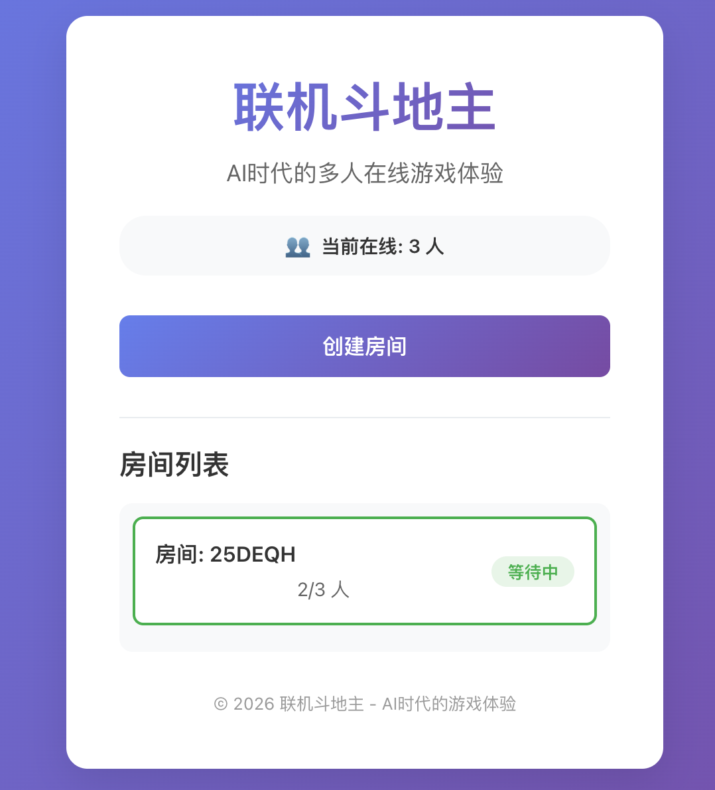
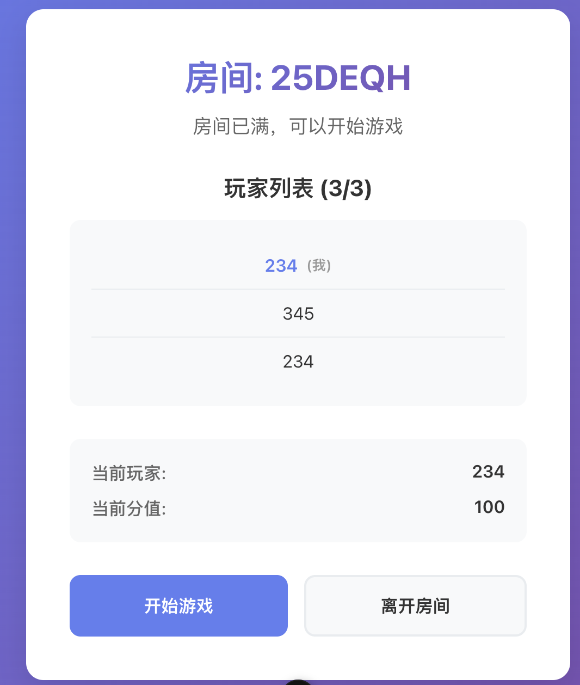
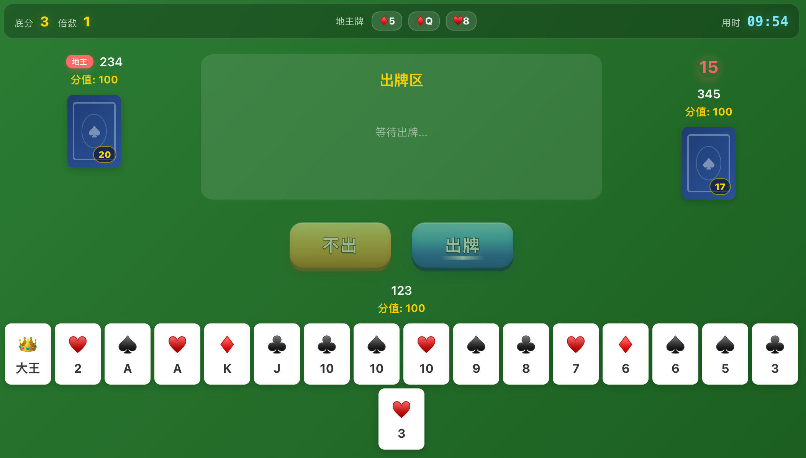

# 多人在线联机斗地主游戏

多人实时斗地主：Node.js 后端（Express + 原生 WebSocket）+ Vue 3 前端，房间与状态持久化使用 MySQL。

## 项目简介

支持创建/加入房间、三人开局、叫分、出牌与过牌、出牌倒计时、断线中止对局等。主客户端为 **Vue 3 + TypeScript**；仓库内仍保留一套静态 HTML/JS 页面作为可选入口。

## 界面截图







## 技术栈

| 层级     | 技术                                                                      |
| ------ | ----------------------------------------------------------------------- |
| 后端     | Node.js、Express、`ws`（WebSocket，路径 `/ws`）、MySQL（`mysql2`）                |
| 实时协议   | JSON 文本帧：`{ "type": "<事件名>", "payload": { ... } }`（与历史 Socket.io 事件名对齐） |
| 主前端    | Vue 3、Vue Router、Pinia、Vite、Sass                                        |
| 可选静态前端 | `frontend/`（HTML/CSS/JS，直连后端同源）                                         |

更细的协议与流程见仓库根目录 [doc.md](./doc.md)。

## 目录结构

```
mmo-doudizhu/
├── backend/
│   ├── server/
│   │   ├── index.js              # HTTP 服务入口，挂载 API 与 WebSocket
│   │   ├── socket.js             # WebSocket 业务：房间、游戏、广播
│   │   ├── wsHub.js              # 连接与房间广播组
│   │   ├── state.js              # 进程内 rooms / players / games / runtime
│   │   ├── adminContext.js       # 管理端操作注入（踢人、删房等）
│   │   ├── handlers/             # WebSocket 消息处理函数
│   │   │   ├── index.js         # 处理函数导出
│   │   │   ├── joinRoom.js      # 加入房间处理
│   │   │   ├── leaveRoom.js     # 离开房间处理
│   │   │   ├── startGame.js     # 开始游戏处理
│   │   │   ├── callLandlord.js  # 叫地主处理
│   │   │   ├── playCards.js     # 出牌处理
│   │   │   ├── pass.js          # 过牌处理
│   │   │   ├── hintRequest.js   # 提示请求处理
│   │   │   ├── getRooms.js      # 获取房间列表处理
│   │   │   ├── getOnlineCount.js # 获取在线人数处理
│   │   │   └── trust.js          # 托管处理
│   │   └── routes/
│   │       ├── api.js           # REST：房间 CRUD 等
│   │       └── admin.js         # 管理端：登录、在线玩家、房间、作弊配置
│   ├── game/                     # 斗地主游戏核心逻辑
│   │   ├── Game.js              # 游戏状态机类
│   │   ├── deck.js              # 牌堆生成、洗牌、发牌
│   │   ├── cardType.js          # 牌型判断（单牌、对子、顺子、炸弹等）
│   │   ├── cardValue.js         # 牌值转换
│   │   ├── cardsValue.js        # 牌组价值计算
│   │   ├── cardCounts.js        # 牌值计数与连牌判断
│   │   ├── canPlay.js           # 出牌合法性判断
│   │   ├── canBeat.js           # 牌的压制判断
│   │   ├── hint.js              # 出牌提示（AI）
│   │   ├── constants.js         # 游戏常量
│   │   └── gameLogic.js        # 模块导出聚合
│   └── db/
│       └── db.js                # MySQL 连接与房间表操作
├── frontend-vue3/               # 主前端（推荐）
│   ├── src/
│   │   ├── views/              # 页面组件
│   │   │   ├── LoginView.vue    # 登录页
│   │   │   ├── HomeView.vue    # 首页
│   │   │   ├── RoomView.vue    # 房间页
│   │   │   ├── GameView.vue    # 游戏页
│   │   │   └── admin/          # 管理后台页面
│   │   ├── components/          # 通用组件
│   │   │   ├── Card.vue        # 卡牌组件
│   │   │   ├── CardBack.vue    # 背面卡牌
│   │   │   ├── CardFlyAnimation.vue # 卡牌飞行动画
│   │   │   ├── Countdown.vue   # 倒计时组件
│   │   │   ├── GameTopBar.vue  # 游戏顶栏
│   │   │   ├── GameMessage.vue # 游戏消息
│   │   │   ├── LandlordCards.vue # 地主牌展示
│   │   │   ├── PlayArea.vue    # 出牌区域
│   │   │   └── PlayerArea.vue  # 玩家区域
│   │   ├── composables/
│   │   │   ├── useSocket.ts    # WebSocket 连接管理
│   │   │   └── useCountdown.ts # 倒计时逻辑
│   │   ├── services/
│   │   │   ├── apiService.ts   # 房间 API 服务
│   │   │   └── adminApi.ts     # 管理端 API 服务
│   │   ├── stores/              # Pinia 状态管理
│   │   │   ├── playerStore.ts  # 玩家状态
│   │   │   ├── roomStore.ts    # 房间状态
│   │   │   └── gameStore.ts    # 游戏状态
│   │   ├── types/              # TypeScript 类型定义
│   │   │   ├── socket.ts       # WebSocket 消息类型
│   │   │   ├── game.ts         # 游戏相关类型
│   │   │   ├── player.ts       # 玩家类型
│   │   │   └── card.ts         # 卡牌类型
│   │   ├── utils/              # 工具函数
│   │   │   ├── cardHelper.ts   # 卡牌辅助函数
│   │   │   └── gameHelper.ts   # 游戏辅助函数
│   │   └── router/
│   │       └── index.ts        # 路由配置
│   └── vite.config.ts          # Vite 配置
├── frontend/                    # 静态页入口（可选）
│   ├── html/index.html
│   ├── js/main.js
│   └── css/style.css
├── doc.md                       # 协议与实现对照文档
├── package.json                 # 根目录后端依赖与 npm scripts
└── README.md
```

## 环境要求

- Node.js（根目录与 `frontend-vue3/package.json` 中 `engines` 建议版本一致）
- MySQL（配置见 `backend/db/db.js`；未就绪时部分接口可能报错）

## 安装与运行

### 1. 后端（根目录）

```bash
npm install
npm start
# 或开发热重载：npm run dev
```

默认 **HTTP**：`http://localhost:3000`\
**WebSocket**：`ws://localhost:3000/ws`

Express 会托管 `frontend/` 静态资源，因此也可直接访问例如：`http://localhost:3000/html/index.html`。

### 2. 主前端 Vue（开发）

另开终端：

```bash
cd frontend-vue3
npm install
npm run dev
```

默认 Vite：`http://localhost:5173`，并将 `/api`、`/ws` 代理到 `http://localhost:3000`。\
生产构建：

```bash
cd frontend-vue3
npm run build
```

将 `dist` 部署到任意静态服务器时，需保证浏览器能访问同一后端的 `/api` 与 `/ws`（或通过 `VITE_WS_URL` 等配置 WebSocket 地址，见 `useSocket.ts`）。

## 主要功能

- 房间列表、创建房间（REST +实时列表同步）
- 进房、开局、叫分、出牌/过牌、倒计时、结算
- **叫分规则**：叫几分就是底分，且**倍数初始等于底分**（后续炸弹/春天继续翻倍）
- **房间计时**：点击开始游戏进入叫分阶段即开始计时，顶部信息条显示 `mm:ss`；超过 **30 分钟** 服务端强制结束并通知客户端
- **玩家头像**：游戏主界面显示玩家头像，地主玩家头像上方显示地主帽子
- **出牌动画**：其他玩家出牌时，卡牌会从对应方向飞入出牌区
- **要不起按钮**：当玩家手里的牌没有能大过上家出的牌时，显示"要不起"按钮
- **提示按钮**：帮助玩家自动选中可以压过上一家出牌的最优出牌方案
- **托管功能**：玩家可开启托管，托管玩家轮到出牌时系统自动帮玩家出牌/过牌；游戏结束后自动取消托管状态
- **倒计时组件**：使用时钟背景图片，显示当前出牌玩家的倒计时
- **参数配置**：后台管理界面增加"参数配置"菜单，可配置默认玩家分值和房间超时时间
- 在线人数广播、断线后本局中止提示等
- **主界面布局**：左/下(自己)/右结构；左右玩家仅显示 1 张背面牌并叠加剩余张数；中间为出牌区；顶部信息条展示底分/倍数/地主牌/计时
- **管理后台**（`/admin/login`）：在线玩家与踢线、房间管理与删除、作弊发牌目标昵称、参数配置（详见 `backend/server/routes/admin.js`；默认账号见该文件，仅适合内网/演示）

## 注意事项

- 开局需要 **3** 名玩家在房内。
- 连接 ID 为服务端生成的 UUID，与早期 Socket.io 的 socket id 不同。
- 数据库表结构与环境变量以 `backend/db/db.js` 为准；首次使用请按项目约定初始化 MySQL。

