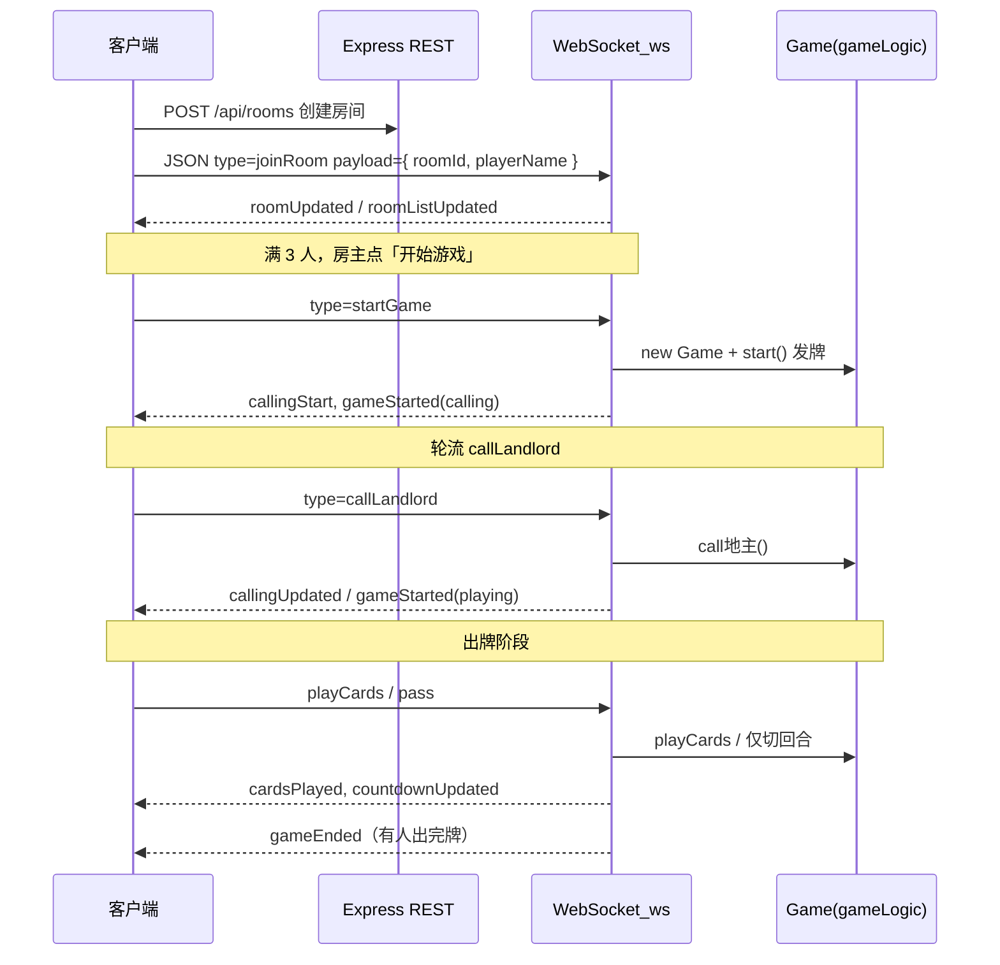

## 联机斗地主游戏

开发了一个可联机的斗地主游戏，支持多个玩家同时参与游戏。

## 游戏规则

### 1. 发牌

- 一副牌共 **54** 张：每人 **17** 张，剩余 **3** 张为底牌。
- 在确定地主之前，玩家**不能**查看底牌。

### 2. 叫牌

- 按出牌顺序轮流叫牌，每人每轮只能叫一次。
- 可选：**1 分**、**2 分**、**3 分**、**不叫**。
- 后叫牌者只能叫**高于**前面已叫最高分，或选择**不叫**。
- **叫牌结束与地主确定**
  - 叫牌结束后，**叫分最高**的玩家为地主。
  - 若有玩家叫 **3 分**，叫牌立即结束，该玩家为地主。
  - 若**所有人都不叫**，则重新发牌并重新叫牌。

### 3. 第一个叫牌的玩家

每局第一个叫分的玩家由**系统随机**指定。

### 4. 出牌

- 三张底牌交给地主，**亮出底牌**，所有玩家可见。
- **地主先出**，之后按逆时针顺序轮流出牌。
- 轮到跟牌时，可选择 **不出**，或出**大于**上一手玩家的牌。
- 任一玩家**出完手牌**，本局结束。

### 5. 牌型

| 牌型        | 说明                                                                                                                                                                                                                                                                                                                                                                                                                                                                   | 示例（示意）                     |
| --------- | -------------------------------------------------------------------------------------------------------------------------------------------------------------------------------------------------------------------------------------------------------------------------------------------------------------------------------------------------------------------------------------------------------------------------------------------------------------------- | -------------------------- |
| **火箭**    | 大王 + 小王，最大牌型                                                                                                                                                                                                                                                                                                                                                                                                                                                         | 大王、小王                      |
| **炸弹**    | 四张同点数                                                                                                                                                                                                                                                                                                                                                                                                                                                                | 四个 7                       |
| **单牌**    | 单张                                                                                                                                                                                                                                                                                                                                                                                                                                                                   | 红桃 5                       |
| **对牌**    | 两张同点数                                                                                                                                                                                                                                                                                                                                                                                                                                                                | 梅花 4 + 方块 4                |
| **三张**    | 三张同点数                                                                                                                                                                                                                                                                                                                                                                                                                                                                | 三个 J                       |
| **三带一**   | 三张同点数 + 一张单牌或一对                                                                                                                                                                                                                                                                                                                                                                                                                                                      | 333+6、444+99               |
| **单顺**    | ≥5 张连续单牌；**不可含 2 与双王**（原文：包括 2 点、不包括双王）                                                                                                                                                                                                                                                                                                                                                                                                                              | 45678、78910JQK             |
| **双顺**    | ≥3 对连续对子；**不可含 2 与双王**                                                                                                                                                                                                                                                                                                                                                                                                                                               | 334455、JJQQKK              |
| **三顺**    | ≥2 组连续三张；**不可含 2 与双王**                                                                                                                                                                                                                                                                                                                                                                                                                                               | 333444                     |
| **飞机带翅膀** | 斗地主中‌飞机带翅膀‌是指两组或以上连续三张牌搭配同等数量的单牌或对子的复合牌型‌**牌型构成与匹配**- ‌**飞机定义**‌：由 2 组及以上连续点数的三张牌组成，例如 333444 或 555666777，点数需连续且不含 2 和王 。‌‌- ‌**翅膀要求**‌：每组三张牌需携带相同数量的单牌或对子，双飞机需带 2 张单牌或 2 对对子，三飞机则带 3 张或 3 对 。‌‌- ‌**匹配规则**‌：飞机组数必须严格等于翅膀数量，且不可混带（不能一部分带单牌、一部分带对子），例如 444555+79 或 333444555+7799JJ 均为有效牌型**出牌限制与禁忌**- ‌**特定牌限制**‌：2 点和双王不可参与组成飞机，部分主流规则中也不能作为翅膀携带，确保牌型逻辑统一 。‌‌- ‌**点数重复**‌：翅膀的点数通常不能与飞机本身的牌点数重复，避免同一张牌被重复计算使用 。‌‌- ‌**压制关系**‌：该牌型可被点数更大的同类型牌型压制，或直接被炸弹、火箭等强力牌型压制 。‌‌ | 444555+79、333444555+7799JJ |
| **四带二**   | 四张同点数 + **两手牌**（两张单或两对等）；**四带二不算炸弹**                                                                                                                                                                                                                                                                                                                                                                                                                                 | 5555+3+8、4444+55+77        |

### 6. 牌型大小

- **火箭**最大，可压任意其他牌。
- **炸弹**仅次于火箭，可压非炸弹牌型；均为炸弹时按**炸弹点数**比大小。
- 除火箭、炸弹外：须**牌型相同**且**总张数相同**才能比较。
- **单牌**比大小（不分花色）：大王 > 小王 > 2 > A > K > Q > J > 10 > … > 3。
- **对子、三张**按其中牌的点数规则比较。
- **顺子**按其中**最大的一张**比。
- **飞机带翅膀、四带二**：按其中的**三顺部分 / 四张部分**比大小，**所带牌不影响**大小。
- **三带一或三带二大小判定**： 其大小比较‌只看**三张相同牌**的点数‌，所带的**单牌**或**对子‌**不影响大小比较‌ ‌
  - ‌相同类型之间比较‌：
    - 例如：KKK + 5 可以管住 QQQ + 9，因为 K > Q。
    - 但 ‌KKK + 5 不能管住 QQQ + JJ‌，因为这是不同类型（三带一 vs 三带二）‌
  - ‌不同类型之间不能互相压制‌：
    - 三带一只能被三带一管‌；
    - ‌三带二只能被三带二管‌；
    - 二者‌不能互相压制‌，即使三张点数更大 ‌
  - ✅ 举例说明：
    - 对方出 ‌999 + 2‌（三带一），你只能用 ‌更大的三带一‌（如 101010 + X）来管；
    - 若对方出 ‌JJJ + QQ‌（三带二），你必须用 ‌更大的三带二‌（如 AAA + KK）才能管；
    - 你‌不能用 KKK + 5 去管 JJJ + QQ‌，反之亦然。

### 7. 胜负判定

任意一家出完牌即结束本局：

- **地主**先出完 → 地主胜。
- **农民**任一方先出完 → 农民胜。

### 8. 积分

**底分**

- 取叫牌阶段叫到的分数：**1 / 2 / 3 分**。

**倍数**

- 初始为 **1**。
- 每出一个**炸弹**：倍数 ×2；**春天**再 ×2（与原文「每炸弹、春天」表述一致）。
- 留在手牌未出的火箭、炸弹**不计入**上述翻倍（原文：火箭和炸弹留在手上没出的不算）。

**一局结束后的得分**

| 结果  | 地主           | 每名农民     |
| --- | ------------ | -------- |
| 地主胜 | +2 × 底分 × 倍数 | −底分 × 倍数 |
| 地主败 | −2 × 底分 × 倍数 | +底分 × 倍数 |

**额外翻倍（原文）**

- 地主出完时，另两家**一张未出**：分数 ×2。
- 某农民先出完，且地主**只出过一手牌**：分数 ×2。

**逃跑**

- 一般逃跑：扣 **底分 × 倍数 × 3**。
- **尚无人叫牌**时逃跑：扣 **3 分**。

**汇总公式（原文）**

> 积分 = 底分 × 倍数 × 玩家身份系数（农民为 1，地主为 2）

## 游戏流程

1. 玩家连接服务器，进入游戏房间。
2. 玩家开始游戏，等待其他玩家玩家。
3. 玩家出牌，根据游戏规则进行判断。
4. 游戏结束，显示游戏结果。

## 技术实现

1. 游戏采用客户端-服务器架构，客户端负责游戏界面和交互，服务器负责游戏逻辑和数据存储。
2. 游戏采用TCP协议进行通信，确保数据的实时性和可靠性。
3. 游戏采用多线程技术，支持多个玩家同时参与游戏。
4. 游戏采用数据库技术，存储玩家信息和游戏数据。
5. 游戏采用游戏引擎技术，实现游戏逻辑和动画效果。
6. 前端使用HTML5CSS3JavaScript实现游戏界面和交互。
7. 后端使用NodeJs框架实现游戏逻辑和数据存储。

## 游戏界面

1. 游戏界面采用图形化界面，包括游戏房间、玩家界面、牌组界面等。
2. 玩家界面包括玩家信息、牌组、出牌按钮等。
3. 游戏房间界面包括游戏房间列表、创建房间按钮、加入房间按钮等。

## 通讯协议

### 1. 协议概述

本通讯协议基于**原生 WebSocket**（Node `ws` 库，路径 `/ws`）实现。每条消息为 UTF-8 文本，JSON 对象：`{"type":"<事件名>","payload":{...}}`（`type` 与原先 Socket.io 事件名一致）。下文表格中的「JSON格式」指 `**payload` 对象\*\* 的内容。

### 2. 事件分类

#### 2.1 客户端发送的事件

| 事件名            | 描述   | JSON格式                                                                                   |
| -------------- | ---- | ---------------------------------------------------------------------------------------- |
| `joinRoom`     | 加入房间 | `{"roomId": "string", "playerName": "string"}`                                           |
| `leaveRoom`    | 离开房间 | `{"roomId": "string"}`                                                                   |
| `startGame`    | 开始游戏 | `{"roomId": "string"}`                                                                   |
| `callLandlord` | 叫地主  | `{"roomId": "string", "score": number}`                                                  |
| `playCards`    | 出牌   | `{"roomId": "string", "cards": [{"suit": "string", "rank": "string", "value": number}]}` |
| `pass`         | 不出牌  | `{"roomId": "string"}`                                                                   |

#### 2.2 服务器发送的事件

| 事件名               | 描述      | JSON格式                                                                                                                                                                                                                                                                                                                                                     |
| ----------------- | ------- | ---------------------------------------------------------------------------------------------------------------------------------------------------------------------------------------------------------------------------------------------------------------------------------------------------------------------------------------------------------- |
| `roomUpdated`     | 房间更新    | `{"room": {"id": "string", "players": [{"id": "string", "name": "string"}], "status": "string"}}`                                                                                                                                                                                                                                                          |
| `gameStarted`     | 游戏开始    | `{"room": {"id": "string", "players": [{"id": "string", "name": "string"}], "status": "string"}, "players": [{"id": "string", "name": "string", "cards": [{"suit": "string", "rank": "string", "value": number}]}], "landlordCards": [{"suit": "string", "rank": "string", "value": number}], "landlordPlayerId": "string", "currentPlayerIndex": number}` |
| `callingUpdated`  | 叫地主状态更新 | `{"currentCallerIndex": number, "highestScore": number, "highestBidder": "string", "gameStatus": "string", "players": [{"id": "string", "name": "string"}]}`                                                                                                                                                                                               |
| `cardsPlayed`     | 出牌      | `{"playerId": "string", "cards": [{"suit": "string", "rank": "string", "value": number}], "players": [{"id": "string", "name": "string", "cards": [{"suit": "string", "rank": "string", "value": number}]}], "currentPlayerIndex": number, "gameStatus": "string", "multiplier": number}`                                                                  |
| `gameEnded`       | 游戏结束    | `{"winnerId": "string", "scores": {"playerId": number}, "baseScore": number, "multiplier": number}`                                                                                                                                                                                                                                                        |
| `playCardsFailed` | 出牌失败    | `{"message": "string"}`                                                                                                                                                                                                                                                                                                                                    |

### 3. 数据结构定义

#### 3.1 玩家对象 (Player)

```json
{
  "id": "string",       // 玩家唯一标识
  "name": "string",     // 玩家名称
  "roomId": "string",   // 房间ID（仅客户端使用）
  "cards": [             // 玩家手牌
    {
      "suit": "string",  // 花色（♠♥♦♣）
      "rank": "string",  // 牌面（A,2,3,...,K）
      "value": number     // 牌值（用于比较大小）
    }
  ]
}
```

#### 3.2 房间对象 (Room)

```json
{
  "id": "string",       // 房间ID
  "players": [           // 房间内玩家
    {
      "id": "string",   // 玩家唯一标识
      "name": "string"  // 玩家名称
    }
  ],
  "status": "string"     // 房间状态（waiting, calling, playing）
}
```

#### 3.3 卡牌对象 (Card)

```json
{
  "suit": "string",      // 花色（♠♥♦♣）
  "rank": "string",      // 牌面（A,2,3,...,K）
  "value": number         // 牌值（用于比较大小）
}
```

## 增加出牌倒时计功能

- 服务器端应该增加一个出牌倒计时，防止 当前出牌玩家一直没有出牌，默认计时为30秒，可以修改。
- 如果倒计时结束时玩家 没有出牌， 则流转到下个玩家
- 如果倒计时结束前玩家完成出牌，则停止倒计时，并为下个玩家重新计时。
- 在主界面当前出牌玩家标识处显示倒计时数字。所有玩家可以看到。
- 轮转逻辑与“不出”功能 一至，直到流转到最后出牌的玩家那里，这时候服务器不再计时 ，因为该玩家必须出牌。

# 新功能需求增加

## 主界面增加”房间列表功能“

- 页面加载时，请求后端 接口，后端 从房间数据表中查询所有房间
- 玩家可以在主界面的”创建房间“按钮创建房间，点击按钮弹出Modal层，玩家输入”玩家名称“就可以创建，房间id由后端 生成唯一值，可以用数据库的自增ID
- 房间显示三种状态：
  - 等待中：当房间人数不足3人时。
  - 已开始：当房间人数达到3人而且游戏已经开始。
  - 满员中：当房间人数达到3人且游戏没有开始时。
- 当玩家点击”等待中“的房间时，弹出Modal层，用户输出玩家名称，即可进入房间。
- 当玩家点击”已开始“或”满员中“的房间时，给出相应提示。

***

## 前后端架构与游戏交互（实现对照）

下文概括当前仓库中的**游戏流程、后端逻辑、前后端如何通过 Socket / HTTP 协作**，便于对照代码阅读。

### 1. 技术结构（简要）

| 层    | 技术                                                                                                                               |
| ---- | -------------------------------------------------------------------------------------------------------------------------------- |
| 后端   | Express + `**ws`（WebSocketServer，`/ws`）\*\*，房间 / 持久化用 MySQL（`backend/db/db.js`）                                                  |
| 游戏逻辑 | `backend/game/gameLogic.js`（`Game` 类 + 牌型 / 比大小）                                                                                 |
| 前端   | Vue 3 + Pinia，`frontend-vue3/src/composables/useSocket.ts` 单例连接 `ws(s)://<host>/ws`（开发环境经 Vite 将 `/ws` 代理到后端；生产可设 `VITE_WS_URL`） |

- **HTTP**：创建 / 查询房间列表等（例如 `POST /api/rooms`）。
- **WebSocket**：进房、开局、叫分、出牌、过牌、房间广播、倒计时等。

### 2. 端到端流程（玩家视角）



### 3. 后端：`backend/server/socket.js` 中与游戏相关的 WebSocket 消息

（入口 `backend/server/index.js` 创建 HTTP `server` 后调用 `attachWebSocketHandlers(server, state)`；进程内状态见 `backend/server/state.js`。连接 ID 为服务端 `randomUUID()`，房间广播经 `backend/server/wsHub.js` 的 `broadcastRoom` / `sendTo` / `broadcastAll`。）

**房间与列表**

- `joinRoom`：查 DB 房间是否存在 → 内存 `rooms` / `players` → `hub.setRoom(connectionId, roomId)` → `roomUpdated` → `broadcastRoomList` → `roomListUpdated`。
- `leaveRoom` / `disconnect`：可能删房、删 `games`、DB `deleteRoom`，并发 `roomDeleted` / `roomUpdated`。

**开局**

- `startGame`：满 3 人时 `new Game(roomId, room.players)`，`game.start()` 发牌；`games.set(roomId, game)`；DB 房间状态改为 `playing`；广播 `callingStart`、`gameStarted`（含手牌、底牌、叫分信息）。

**叫分**

- `callLandlord`：`game.call地主(connectionId, score)`；广播 `callingUpdated`；若进入出牌阶段再发一次 `gameStarted`（带 `gameStarted: true`），并 `startCountdown(roomId)`。

**出牌 / 过牌**

- `playCards`：成功则 `cardsPlayed`，若 `status === 'ended'` 再 `gameEnded`，并重置房间为 `waiting`。
- `pass`：当前玩家且「上一手不是自己」时，只推进 `currentPlayerIndex`，同样发 `cardsPlayed`（`cards: []`）。

**倒计时**

- `startCountdown`：出牌阶段 30s；若当前回合玩家就是 `lastPlayerId`（上一手是自己），不倒计时、必须出牌；超时则自动轮到下家并发一次类似「空出牌」的 `cardsPlayed`（实现中有硬编码的上家索引，属实现细节）。

相关代码位置：`backend/server/socket.js` 中 `startGame`、`callLandlord`、`playCards`、`pass`、`startCountdown` 等处理器。

### 4. 游戏逻辑：`backend/game/gameLogic.js`（权威规则）

`**Game` 状态\*\*

- `status`：`waiting` → `calling` → `playing` → `ended`
- `叫牌状态`：`currentCallerIndex`、`highestScore`、`highestBidder`
- 出牌：`lastCards`、`lastPlayerId`、`currentPlayerIndex`

**发牌** `start()` / `dealCards`：洗牌，3 张底牌进 `地主Cards`，每人 17 张，按点数排序。

**叫地主** `call地主(playerId, score)`

- 只有当前 `currentCallerIndex` 对应玩家可操作。
- `score` 为 1–3 且高于当前 `highestScore` 才更新叫分与最高叫家；`score` 0（不叫）只推进轮次。
- 结束条件：轮完一圈回到**第一个叫牌玩家**的索引，或有人叫到 **3 分**。
  - 有最高叫家 → 底牌并入该玩家，`status = 'playing'`，地主先出。
  - 无人叫 → `start()` **重新发牌**。

**出牌** `playCards(playerId, cards)`

- 须为当前 `currentPlayerIndex`。
- 若上一手不是自己，须 `canPlay(cards, lastCards)`；若上一手是自己，可自由出下一手（清空压制关系）。
- 炸弹：`倍数 *= 2`。
- 有人手牌为空 → `ended`；若其余两家仍各 17 张 → 记「春天」并再 `倍数 *= 2`。
- 积分 `calculateScores()`：按地主赢 / 输、底分、倍数给三人记分。

**牌型** `getCardType` / `canPlay`：单张、对子、三张、三带一、四带二、顺子、双顺、三顺、炸弹 / 王炸等；非炸弹需同型同长度比最大牌点；炸弹可压非炸弹，炸弹间比点数。

### 5. 前端：如何接这些事件

- **连接与发送**：`frontend-vue3/src/composables/useSocket.ts` 封装 `joinRoom`、`startGame`、`callLandlord`、`playCards`、`pass`、`getRooms` 等。
- **房间页** `frontend-vue3/src/views/RoomView.vue`：`startGame` 后立刻 `router.push('/game')`；监听 `callingStart`（他人开局时也能跳进游戏页）、`roomUpdated`、`roomDeleted`。
- **游戏页** `frontend-vue3/src/views/GameView.vue`：`onMounted` 注册 `gameStarted`、`callingUpdated`、`cardsPlayed`、`gameEnded`、`countdownUpdated`、`playCardsFailed`。
  - 第一次 `gameStarted`（无 `gameStarted: true`）：初始化 Pinia `gameStore`，显示叫分弹窗，`callLandlord` 走 socket。
  - 第二次 `gameStarted`（`gameStarted: true`）：关闭叫分、更新地主与手牌、进入出牌 UI。
  - `handleCardsPlayed`：更新当前玩家索引、倍数；有牌则写入 `playedCards`；自己则从 `myCards` 移除，别人则减 `cardCount`。

`frontend-vue3/src/stores/gameStore.ts` 负责：`myCards`、`playedCards`、`callingInfo`、是否可「不出」`canPass`（与后端「上一手必须跟」的规则对齐）等。

### 6. 值得留意的实现细节（读代码时有用）

1. `**createRoom`**：前端** **`apiService`** **走 REST，`useSocket`** **里虽有** **`createRoom`** **发送，但当前**服务端没有\*\*处理 `type: createRoom`，实际以 HTTP 为准。
2. `**roomUpdated` 载荷\*\*：服务端发的是 `{ roomId, players }`，`RoomView` 里兼容了 `data.room?.players`。
3. `**cardsPlayed` 里没有 `playerName`\*\*：后端只发 `playerId`；若界面依赖 `playerName`，需要前端用 `roomStore` 再解析（类型里可能有 `playerName` 可选）。

## 新增需求

需要增加一些游戏过程体验的变更

- 游戏过程中，轮到出牌的玩家会在玩家手牌区域的右上角显示文字提示，内容为“轮到你出牌了”，玩家出牌后，该文字自动消失。

## 游戏主界面重构需求

- 整体游戏主界面三个玩家的位置改为，左，下，右结构。下方底部玩家为自己。
- 不再显示左右玩家的牌的背面效果，只需显示一张背面效果，里面显示当前玩家的剩余牌数即可。
- 出牌区域在放在页面中间。
- 主界面顶部信息条显示当前房间的底分，倍数还有地主牌信息
- 增加一个房间游戏计时：当游戏正式开始时，服务端开始计时，并实时通知客户端更新显示。当游戏结束或中途有玩家退出，则计时结束并销毁资源占用。
- 房间游戏计时放在顶部信息条上。

## 后台管理功能需求

1. 后端服务新增数据表paramters,用于存储游戏运行时的参数配置
2. 搜索关于玩家默认分值1000的相关代码实现
3. 搜索关于房间倒时间默认30分钟的代码实现
4. 后台管理界面增加一个叫：“参数配置”的菜单
5. 将默认分值和默认倒计时30分钟后当前房间游戏自动结束这两个参数的配置加到后台管理功能中

## 出牌动画优化

增加玩家出牌飞入出牌区的动画，具体需求如下 ：

1. 出牌区先不渲染玩家出的牌，而是通过动画后再在出牌区显示
2. 左侧玩家出的牌，从左往向飞到出牌区
3. 右侧玩家出的牌，从右往走飞到出牌区
4. 底部玩家（自己）出的牌，是从手牌区飞到出牌区

