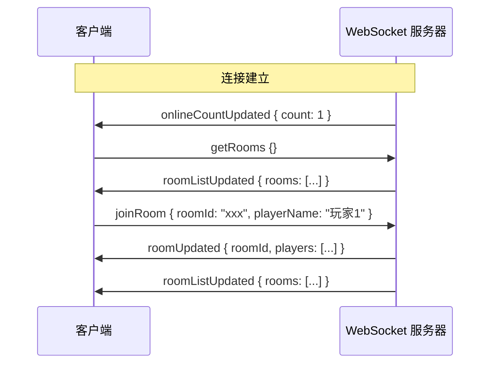
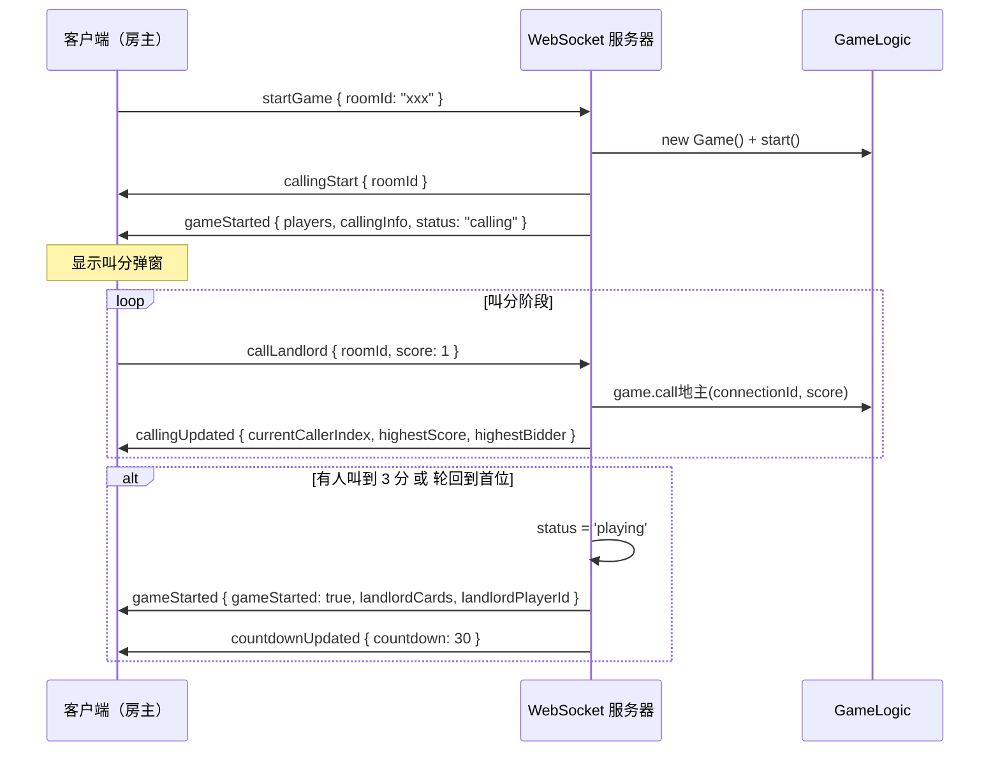
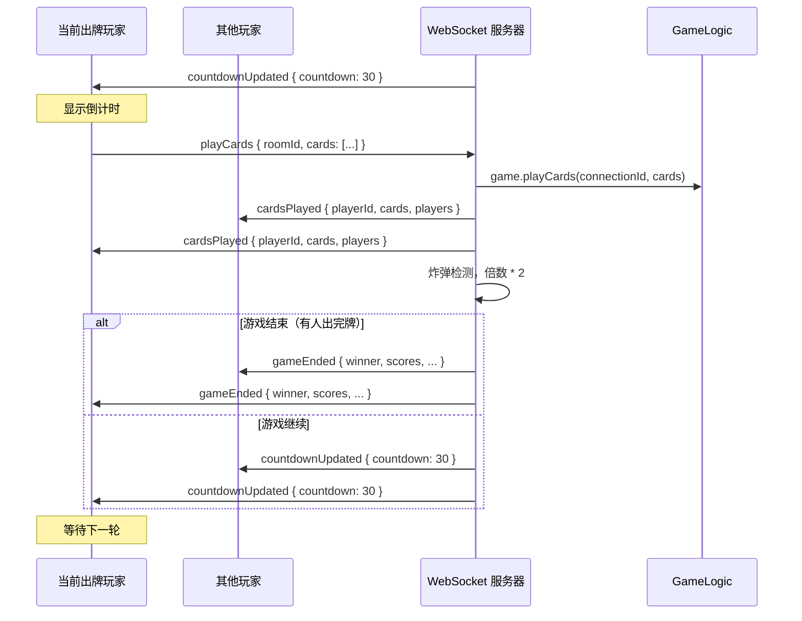
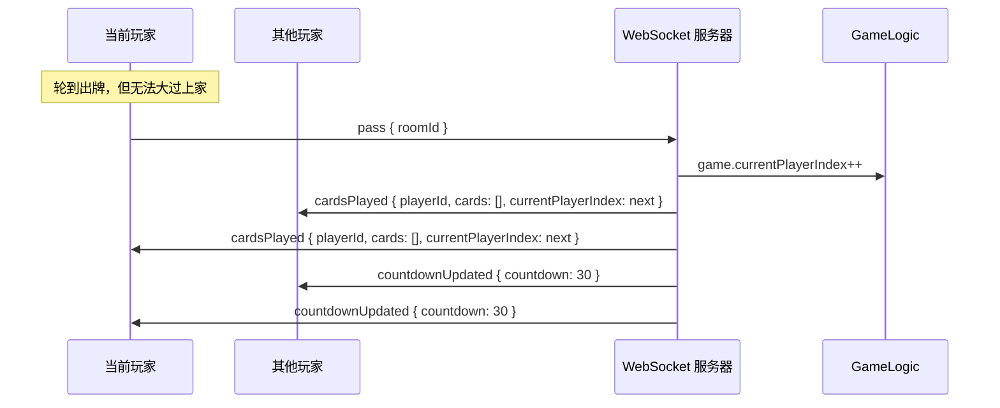
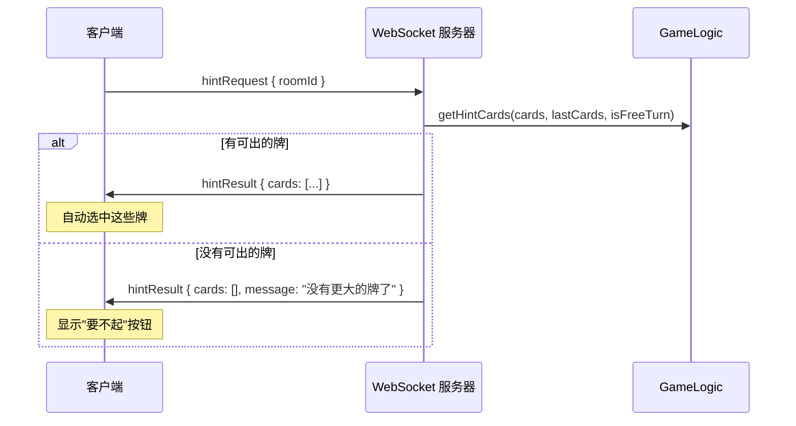
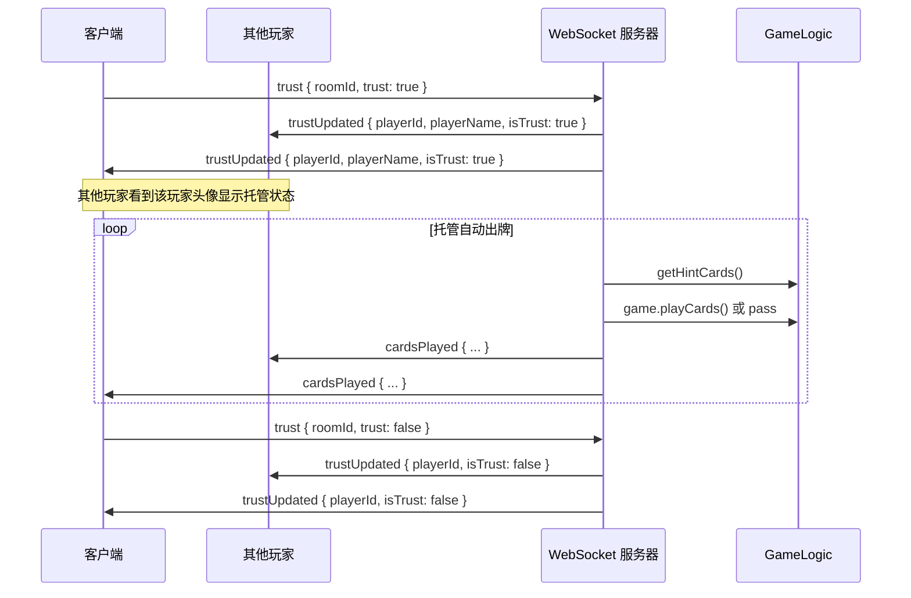
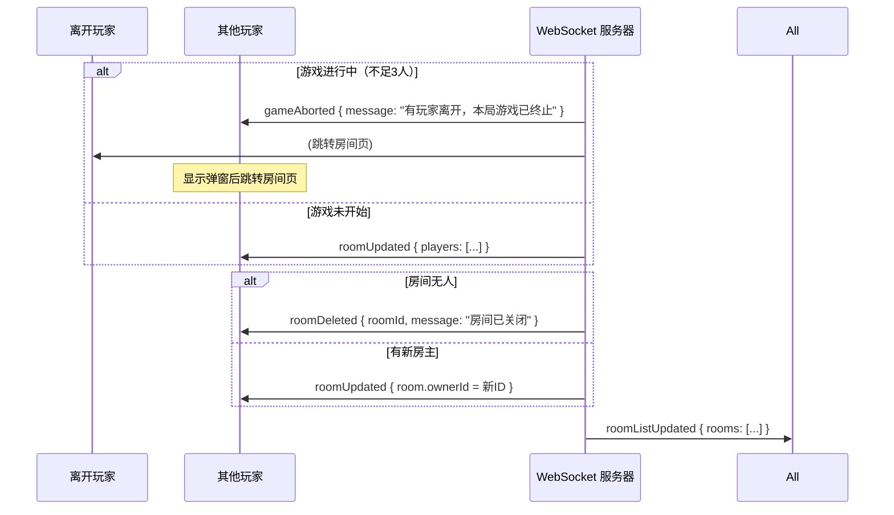
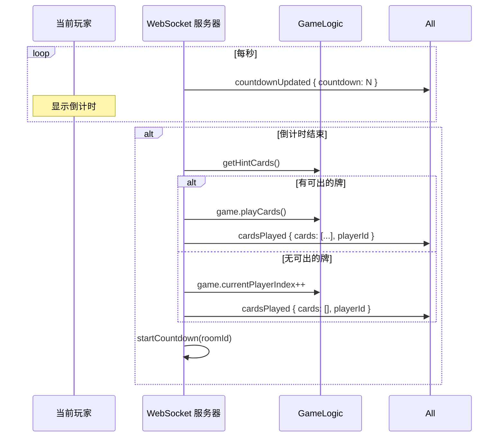
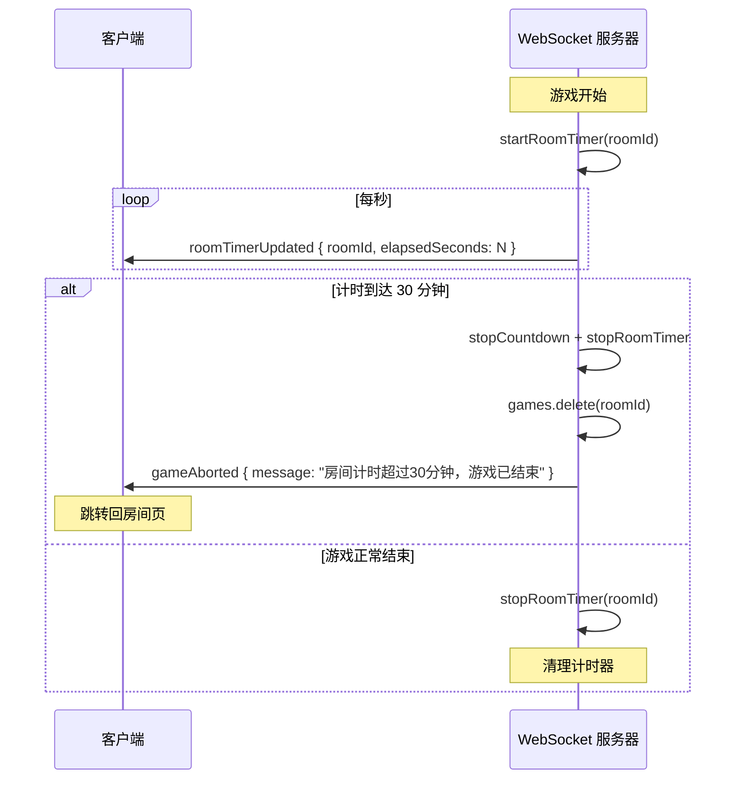
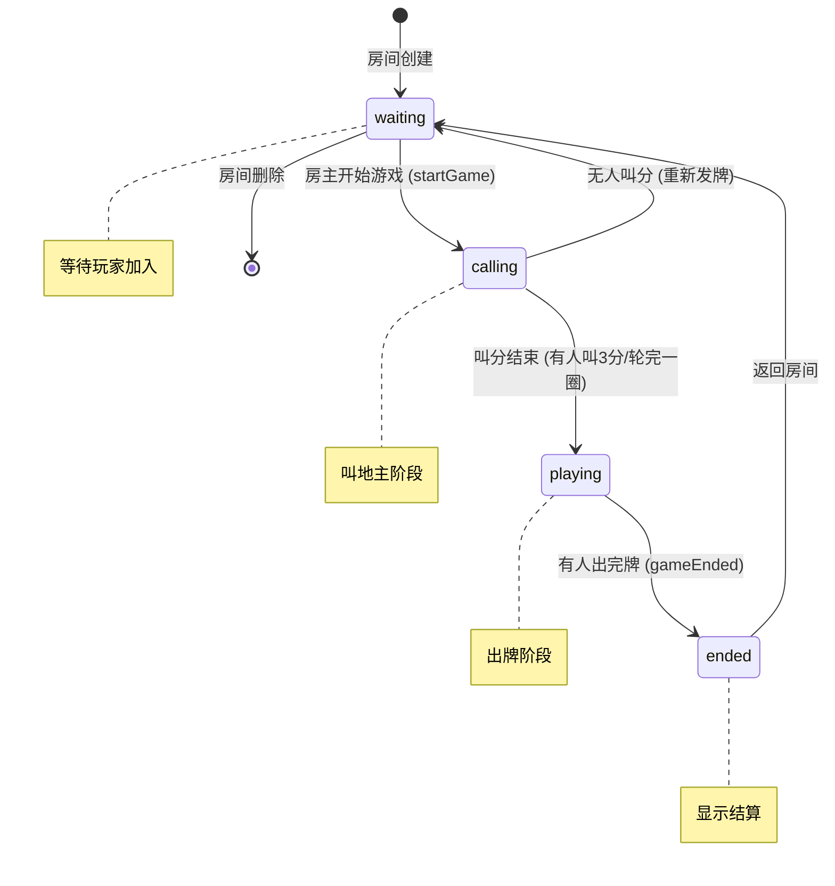

# 斗地主游戏前后端通讯协议

## 1. 协议概述

本游戏采用 **WebSocket** 进行实时双向通信，连接路径为 `/ws`。

### 1.1 消息格式

每条消息为 UTF-8 编码的 JSON 对象：

```json
{
  "type": "<事件名>",
  "payload": { ... }
}
```

- `type`：事件名称（字符串）
- `payload`：事件数据对象（根据事件类型不同，结构不同）

### 1.2 技术架构

| 层级 | 技术实现 |
|------|----------|
| 后端 | Express + `ws` 库（WebSocketServer） |
| 游戏逻辑 | `backend/game/gameLogic.js`（Game 类） |
| 前端 | Vue 3 + Pinia，`/ws` 路径连接服务器 |
| HTTP | 创建/查询房间列表等 RESTful 接口 |

---

## 2. 客户端发送事件（Client → Server）

| 事件名 | 描述 | payload 结构 |
|--------|------|-------------|
| `getOnlineCount` | 获取在线人数 | `{}` |
| `joinRoom` | 加入房间 | `{ roomId: string, playerName: string, password?: string }` |
| `leaveRoom` | 离开房间 | `{ roomId: string }` |
| `startGame` | 开始游戏 | `{ roomId: string }` |
| `callLandlord` | 叫地主 | `{ roomId: string, score: number }`（0=不叫，1/2/3=叫分） |
| `playCards` | 出牌 | `{ roomId: string, cards: Card[] }` |
| `pass` | 不出/过牌 | `{ roomId: string }` |
| `hintRequest` | 请求提示 | `{ roomId: string }` |
| `trust` | 托管/取消托管 | `{ roomId: string, trust: boolean }` |
| `getRooms` | 获取房间列表 | `{}` |

### 2.1 Card 数据结构

```typescript
interface Card {
  suit: string;   // 花色：'spade'(♠), 'heart'(♥), 'diamond'(♦), 'club'(♣), 'joker'
  rank: string;   // 点数：'3'-'10', 'J', 'Q', 'K', 'A', '2', 'small_joker', 'big_joker'
  value: number;  // 牌值：3-15（3-10对应3-10，J=11, Q=12, K=13, A=14, 2=15, 小王=16, 大王=17）
}
```

---

## 3. 服务端发送事件（Server → Client）

| 事件名 | 描述 | payload 结构 |
|--------|------|-------------|
| `onlineCountUpdated` | 在线人数更新 | `{ count: number }` |
| `roomListUpdated` | 房间列表更新 | `{ rooms: RoomListItem[] }` |
| `roomUpdated` | 房间信息更新 | `{ roomId: string, players: PlayerBase[] }` |
| `joinRoomFailed` | 加入房间失败 | `{ message: string }` |
| `roomDeleted` | 房间已删除 | `{ roomId: string, message: string }` |
| `callingStart` | 开始叫分 | `{ roomId: string }` |
| `gameStarted` | 游戏开始/状态更新 | 见下方详细结构 |
| `callingUpdated` | 叫分状态更新 | `{ currentCallerIndex, highestScore, highestBidder, gameStatus, players }` |
| `cardsPlayed` | 出牌/过牌广播 | 见下方详细结构 |
| `countdownUpdated` | 倒计时更新 | `{ countdown: number, currentPlayerIndex: number, players }` |
| `playCardsFailed` | 出牌失败 | `{ message: string }` |
| `hintResult` | 提示结果 | `{ cards: Card[], message?: string }` |
| `trustUpdated` | 托管状态更新 | `{ playerId: string, playerName: string, isTrust: boolean }` |
| `roomTimerUpdated` | 房间计时更新 | `{ roomId: string, elapsedSeconds: number }` |
| `gameAborted` | 游戏中止 | `{ roomId: string, message: string }` |
| `gameEnded` | 游戏结束 | `{ winner, landlordPlayerId, scores, baseScore, multiplier, isSpring, players }` |

### 3.1 gameStarted 事件 payload

```typescript
interface GameStartedData {
  room: {                           // 房间信息
    id: string
    players: { id: string, name: string }[]
    status: string                  // 'calling' | 'playing'
  }
  players: Player[]                // 玩家手牌信息（自己可见 cards，其他人仅可见 cardCount）
  landlordCards: Card[]             // 底牌（叫分结束后可见）
  landlordPlayerId: string | null   // 地主玩家 ID
  currentPlayerIndex: number        // 当前出牌玩家索引
  baseScore: number                // 底分
  multiplier: number               // 倍数
  callingInfo?: {                   // 叫分信息（叫分阶段有）
    currentCallerIndex: number
    highestScore: number
    highestBidder: string | null
  }
  gameStarted?: boolean             // true 表示叫分结束，进入出牌阶段
}
```

### 3.2 callingUpdated 事件 payload

```typescript
interface CallingUpdatedData {
  currentCallerIndex: number        // 当前叫分玩家索引
  highestScore: number              // 当前最高叫分
  highestBidder: string | null     // 最高叫分玩家 ID
  gameStatus: string                // 'calling' | 'playing'
  players: { id: string, name: string }[]
}
```

### 3.3 cardsPlayed 事件 payload

```typescript
interface CardsPlayedData {
  playerId: string                 // 出牌玩家 ID
  cards: Card[]                    // 出示的牌（空数组表示过牌）
  players: Player[]                 // 玩家手牌快照（自己可见 cards，其他人仅可见 cardCount）
  currentPlayerIndex: number        // 下一位出牌玩家索引
  multiplier: number                // 当前倍数
  gameStatus: string                // 'playing' | 'ended'
  canBeatLastCards?: boolean         // 下一位玩家是否能大过当前出的牌
}
```

### 3.4 roomListUpdated 事件 payload

```typescript
interface RoomListData {
  rooms: {
    id: string
    players: { id: string, name: string, isLandlord: boolean, score: number }[]
    status: string                 // 'waiting' | 'calling' | 'playing'
    playerCount: number
    maxPlayers: number
    roomStatus: string              // 'waiting' | 'full' | 'playing'
    hasPassword: boolean
  }[]
}
```

---

## 4. 数据结构定义

### 4.1 Player（玩家）

```typescript
interface Player {
  id: string
  name: string
  cards: Card[]                     // 手牌（仅自己可见完整数据）
  cardCount?: number                // 手牌数量（其他玩家可见）
  isTrust?: boolean                 // 是否托管
}
```

### 4.2 Room（房间）

```typescript
interface Room {
  id: string
  players: { id: string, name: string }[]
  status: 'waiting' | 'calling' | 'playing'
}
```

---

## 5. 交互时序图

### 5.1 玩家连接与加入房间



### 5.2 开始游戏与叫分流程



### 5.3 出牌与过牌流程



### 5.4 过牌（不出）流程



### 5.5 提示功能流程



### 5.6 托管功能流程



### 5.7 玩家离开房间流程



### 5.8 倒计时超时自动出牌



### 5.9 房间计时器（30分钟上限）



---

## 6. 错误处理

### 6.1 出牌失败（playCardsFailed）

当玩家出牌不符合规则时，服务器返回：

```json
{
  "type": "playCardsFailed",
  "payload": {
    "message": "出牌无效"
  }
}
```

常见错误消息：
- `"出牌无效"` - 牌型不符合规则
- `"当前出牌区的牌是您出的，必须出牌"` - 自己出的牌不能过
- `"还没轮到您"` - 不是当前出牌玩家

### 6.2 加入房间失败（joinRoomFailed）

```json
{
  "type": "joinRoomFailed",
  "payload": {
    "message": "房间不存在" | "房间密码错误"
  }
}
```

### 6.3 游戏中止（gameAborted）

```json
{
  "type": "gameAborted",
  "payload": {
    "roomId": "xxx",
    "message": "有玩家离开，本局游戏已终止，请返回房间" | "房间计时超过30分钟，游戏已结束"
  }
}
```

---

## 7. 游戏状态流转



---

## 8. 广播机制

### 8.1 广播类型

| 方法 | 说明 |
|------|------|
| `hub.sendTo(connectionId, type, payload)` | 向指定连接发送消息 |
| `hub.broadcastRoom(roomId, type, payload)` | 向房间内所有连接广播（相同消息） |
| `hub.broadcastRoomEach(roomId, type, buildPayload)` | 向房间内每个连接发送定制消息（通过 callback 生成） |
| `hub.broadcastAll(type, payload)` | 向所有连接广播 |

### 8.2 典型场景

- `roomUpdated`、`trustUpdated` 使用 `broadcastRoom`（所有玩家看到相同数据）
- `cardsPlayed`、`gameStarted` 使用 `broadcastRoomEach`（每个玩家看到的 `cards`/`players` 字段不同：自己看到完整手牌，其他人只看到 `cardCount`）
- `roomListUpdated` 使用 `broadcastAll`（所有在线玩家更新房间列表）

---

## 9. 事件完整列表汇总

### 9.1 客户端 → 服务器（10个）

| 事件 | 类型 | 说明 |
|------|------|------|
| `getOnlineCount` | 请求 | 获取在线玩家数量 |
| `getRooms` | 请求 | 获取房间列表 |
| `joinRoom` | 请求 | 加入指定房间 |
| `leaveRoom` | 请求 | 离开指定房间 |
| `startGame` | 请求 | 房主开始游戏 |
| `callLandlord` | 请求 | 叫地主（0不叫，1/2/3叫分） |
| `playCards` | 请求 | 出牌 |
| `pass` | 请求 | 不出/过牌 |
| `hintRequest` | 请求 | 请求出牌提示 |
| `trust` | 请求 | 设置托管状态 |

### 9.2 服务器 → 客户端（16个）

| 事件 | 类型 | 说明 |
|------|------|------|
| `onlineCountUpdated` | 广播 | 在线人数更新 |
| `roomListUpdated` | 广播 | 房间列表更新 |
| `roomUpdated` | 广播 | 房间玩家变化 |
| `joinRoomFailed` | 单发 | 加入房间失败 |
| `roomDeleted` | 广播 | 房间被删除 |
| `callingStart` | 广播 | 开始叫分阶段 |
| `gameStarted` | 广播 | 游戏开始/状态更新 |
| `callingUpdated` | 广播 | 叫分状态更新 |
| `cardsPlayed` | 广播 | 出牌/过牌事件 |
| `countdownUpdated` | 广播 | 倒计时更新 |
| `playCardsFailed` | 单发 | 出牌失败 |
| `hintResult` | 单发 | 提示结果 |
| `trustUpdated` | 广播 | 托管状态更新 |
| `roomTimerUpdated` | 广播 | 房间计时更新 |
| `gameAborted` | 广播 | 游戏中止 |
| `gameEnded` | 广播 | 游戏结束 |
